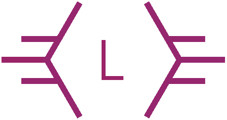

<!-- PROJECT LOGO -->
 

  

<h3 align="center">Mi Portfolio</h3>

  

     Codigo fuente de mi portfolio
     
    <a href="https://github.com/LeonelAlderete/portfolio.v2"><strong>Ver documentos »</strong></a>
     
     
    <a href="https://leonel-alderete.netlify.app/">Ver Demostracion</a>
    ·
    <a href="https://github.com/LeonelAlderete/portfolio.v2/issues">Reportar Bug</a>
  

<!-- ABOUT THE PROJECT -->

### Construido con

- [HTML](https://github.com/LeonelAlderete/portfolio.v2/#)
- [CSS](https://github.com/LeonelAlderete/portfolio.v2/#)
- [CSS Grid](https://github.com/LeonelAlderete/portfolio.v2/#)
- [CSS Flex Box](https://github.com/LeonelAlderete/portfolio.v2/#)

<!-- CONTACT -->

## Contactarme

GitHub - [LeonelAlderete](https://github.com/LeonelAlderete)

Linkedin - [Leonel Alderete](https://www.linkedin.com/in/leonel-alderete/)

(<a href="#top">Volver arriba</a>)

